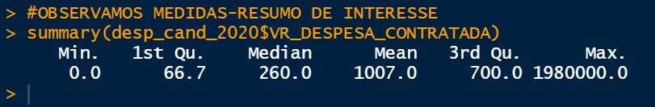
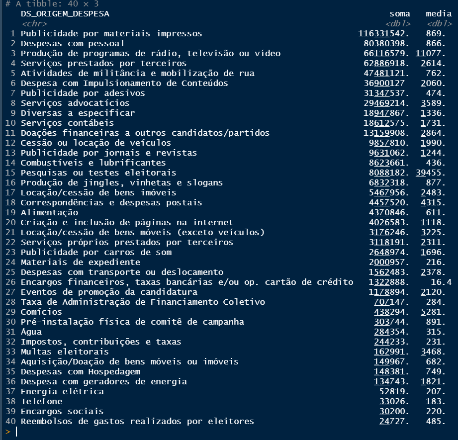

# Despesas feitas por candidatos no estado de SP no pleito municipal 2020 #
### Este script foi criado por [Jonas Arjona](https://www.linkedin.com/in/jonas-arjona-639497190/) como parte de um projeto de capacitação em linguagem R promovido pelo Núcleo de Estudos Integrados em Democracia, Comunicação e Sociedade (DECOS), liderado pela professora Dra. [Gleidylucy Oliveira da Silva](http://lattes.cnpq.br/1871892858720738). ###

Neste script desenvolveremos uma breve análise dos dados de despesas contratadas pelos candidatos do estado de São Paulo no pleito municipal de 2020. A escolha dessa recorte se dá por conta da menor relevância dada à disputa municipal se comparada à nacional. Além disso, São Paulo foi escolhido por ser o estado com o maior colégio eleitoral do país. As conclusões aqui elaboradas não irão necessariamente refletir a dinâmica nacional, objetivamos apenas treinar etapas próprias de um projeto em análise de dados.

## Primeiro passo: a pergunta de pesquisa
Antes de mais nada, é preciso deixar bem evidente qual o objetivo do projeto de análise a ser desenvolvido, em especial qual é a pergunta de pesquisa e/ou problema de negócio (para análises voltadas à iniciativa privada) que o norteia. Isso porque os esforços subsequentes partirão da premissa que nossos dados coletados e métodos escolhidos são condizentes com nossas expectativas.
Logo, se por exemplo eu pretendo compreender os efeitos de determinadas variáveis sociodemográficas num fenômeno social, eu preciso saber:
* Quais são as melhores e mais confiáveis fontes tanto para minha variável dependente quanto as independentes;
* Eventuais dilemas que as escolhas terão nos resultados (por exemplo, os efeitos de maneiras distintas de registrar um aspecto sociodemográfico);
* Lacunas na análise a serem reconhecidas e/ou exploradas posteriormente.

Assim, precisamos definir de maneira objetiva uma pergunta de pesquisa principal e auxiliares, estas últimas atuando como etapas para responder o questionamento principal. Para nossa pergunta principal temos:

**Há algum evidente padrão nos dados de despesas eleitorais contratadas pelas candidaturas do estado de SP em 2020?**

E como perguntas auxiliares:
* Há quantas despesas declaradas no geral? E por sexo/cargo/partido?
* Quanto foi gasto por cada um dos possíveis valores dessas variáveis?
* Quantas e quais são os totais gastos por tipo de despesa? É possível melhorar essa visualização?
* Há padrões entre as variáveis citadas acima e gastos?

## Segundo passo: os dados e suas fontes
Como estaremos usando de dados eleitorais, podemos coletá-los do site do Tribunal Superior Eleitoral(TSE) [neste link](https://dadosabertos.tse.jus.br/dataset/?q=2020), que corresponde à página para o pleito de 2020.
Precisamos simultaneamente de dados de despesas e sociodemografia das candidaturas, dois grupos de variáveis separados. Por isso, empreenderemos numa união das fontes num só arquivo em formato ".csv".
Baixaremos então os arquivos originais no site do TSE: "Candidatos - 2020" para dados sociodemográficos; "Prestação de Contas Eleitorais - 2020" para dados das despesas. Extrairemos os arquivos ".rar" para obtermos os dados em ".csv" para cada estado. Por fim, separaremos os arquivos do estado de SP. Junto dos arquivos compactados, também temos o arquivo "LEIAME.pdf", com instruções sobre a estrutura dos dados.

Partimos então para o RStudio, onde iremos selecionar nosso "working directory" e carregar os pacotes úteis. Além disso, como mexeremos com cifras bastante elevadas, rodaremos a função **options** com o argumento **scipen = 999** para desabilitar a notação científica automática do RStudio.

```r
#WORKING DIRECTORY 
setwd([DIRETÓRIO DE SUA ESCOLHA])
getwd()

#PACOTES
library(tidyverse)
library(ggplot2)

#OPTIONS
options(scipen = 999)
```

Iremos abrir os dois arquivos **.csv** no RStudio e associá-los a dois objetos: **desp_2020** e **cand_2020**.

```r
#DADOS
desp_2020<- read.csv(file = "desp_sp_2020.csv",header = T, sep = ";", 
                 fileEncoding = "latin1",dec = ",")
cand_2020<- read.csv(file = "cand_sp_2020.csv",header = T, sep = ";", 
                 fileEncoding = "latin1",dec = ",")
```
Em seguida, iremos selecionar apenas candidaturas deferidas de fato e as variáveis relevantes de **cand_2020**. Abaixo temos o nome das variáveis e a distribuição das observações na variável **DS_DETALHE_SITUACAO_CAND** que registra deferência.

```r
colnames(cand_2020) 
table(desp_2020$DS_DETALHE_SITUACAO_CAND)
```


Muitas variáveis redundantes e muitas formas de atestar indeferência. Nas próximas linhas, reduzidos as variáveis e filtramos pela deferência.

```r
#LIMPEZA
var_rem <- c(1:14,17:42,45,56:71)
sel_sit <- c("DEFERIDO","DEFERIDO COM RECURSO")

cand_2020<- cand_2020 %>% 
  filter(DS_DETALHE_SITUACAO_CAND %in% sel_sit) %>% 
  select(-all_of(var_rem))
```

Por fim, faremos um "inner_join" entre os dois DFs usando como primary key **SQ_CANDIDATO**. Além disso, removeremos mais variáveis irrelevantes e redundantes. Nosso **data.frame** final será chamado de **desp_cand_2020**.

```r
#CRIAÇÃO DO DF FINAL
desp_cand_2020 <- inner_join(desp_2020,cand_2020,by = "SQ_CANDIDATO") %>% 
  select(1:21,55:66,22:53)
```

Temos abaixo o **head** do nosso data.frame

```r
head(desp_cand_2020)
```


Antes de finalizarmos esse passo, vamos checar um das implicações do nosso join. O **inner_join** resulta num **data.frame** que só possui as observações que estão presentes nos dois objetos unidos. Logo, se tivéssemos um candidato sem despesas ou uma despesa sem candidato (algo impossível porque a despesa registrada é sempre feita por uma candidatura), ambos estariam excluídos de **desp_cand_2020**. Isso por si só já pode ser algo útil para uma análise já que podemos encontrar padrões de não-gasto, isto é, de menor investimento e/ou até desamparo por parte dos partidos dessas candidaturas sem despesas.

Então distinguimos os **SQ_CANDIDATO** de **cand_2020** que não se encontram em **desp_2020** dos que se encontram, ou seja, candidaturas registradas e deferidas, mas que não possuem gastos. Em seguida criamos um novo **data.frame** com uma variável que distingue candidaturas com gastos daquelas sem gastos.

```r
n_gasto <- cand_2020 %>% 
  mutate(FEZ_GASTO = ifelse(SQ_CANDIDATO %in% desp_2020$SQ_CANDIDATO,
                            "SIM","NÃO"))

n_gasto %>% 
  group_by(DS_CARGO,FEZ_GASTO) %>% 
  summarise(contagem = n())
```


Muito mais candidaturas à vereador não fizeram gastos do que aquelas para prefeito, tanto em números absolutos quanto em proporções. Vice-prefeitos não são votados mas precisam ser registrados e ficam sob a campanha principal do prefeito, o que explica a discrepâncias. Outros cruzamentos, como sexo, partido, idade e cor/raça podem eventualmente mostrar outros achados. 

## Terceiro passo: um mergulho preliminar
Agora iremos dar início propriamente à nossa análise. Este tópico em específico será usado para conhecermos os nossos dados e eventuais relações que eles podem demonstrar. Para isso, usaremos funções em R que geram medidas-resumo, descrição da estrutura dos dados e **pipes** de agrupamento e **summarise**. Além disso, plotaremos alguns gráficos, mesmo que pouco intuitivos e/ou visualmente objetivos. 
Evidemente os resultados aqui descritos não se encontrariam num relatório final de análise de dados a ser entregue às partes interessadas, já que eles possuem como utilidade informar o analista da forma mais simples e rápida possível. É na produção dos gráficos ao final da análise que despenderemos mais tempo em questões estéticas.

Inicialmente, executaremos a função **str**, que descreve o tipo de dados que cada variável tem e alguns exemplos de valores. O mais importante é constatar que a variável de valor da despesa esteja em formato numérico e que não existam erros de reconhecimento de tipo de variável. Ambos esses tópicos não aprensetaram problemas nos nossos dados.

```r
str(desp_cand_2020)
```


Em seguida, medidas-resumo da nossa variável de interesse, **VR_DESPESA_CONTRATADA**, o valor em reais da despesa contratada.

```r
summary(desp_cand_2020$VR_DESPESA_CONTRATADA)
```



Vemos como são díspares as despesas registradas, alguns na casa dos centavos, outras na doo milhares e algumas poucas na casa dos milhões.

Iremos então plotar essas medidas distinguindo as observações por partido, sexo e cargo. Outras variáveis poderiam com toda certeza serem usadas aqui, apenas demos preferência para esses citadas. Também plotamos alguns gráficos-esboço, apenas para mostrar a relação estabelecida e ignorando etapas de renomeação de títulos, subtítulos e eixos.

#### Partido

```r
#MEDIDAS-RESUMO
desp_cand_2020 %>% 
  group_by(SG_PARTIDO) %>% 
  summarise(contagem = n(),
            soma = sum(VR_DESPESA_CONTRATADA),
            media = mean(VR_DESPESA_CONTRATADA),
            min = min(VR_DESPESA_CONTRATADA),
            max = max(VR_DESPESA_CONTRATADA)) %>% 
  arrange(desc(soma)) %>% 
  print(n = 32)

```


```r
#GRÁFICO
desp_cand_2020 %>% 
  group_by(SG_PARTIDO) %>% 
  summarise(contagem = n()) %>% 
  ggplot()+
  geom_col(aes(x=reorder(SG_PARTIDO,contagem,sum),y=contagem))+
  coord_flip()
```


Como era de se esperar, os partidos mais bem estabelecidos (mais antigos, consistentes, presentes na cena pública, com mais parlamentares eleitos) são aqueles que demonstram as maiores cifras totais bem como as maiores quantiades de despesa. Curiosamente, eles nem sempre apresentam as maiores médias, perdendo em alguns casos para outros partidos menores como o PSOL e PSL. Isso porque o cálculo de média é altamente influenciável pelo número total de observações de cada partido e por despesas **outliers**. Os valores mínimos em todos esses casos são encargos financeiros, como juros ou taxas bancários.

#### Sexo
```r
#MEDIDAS-RESUMO
desp_cand_2020 %>% 
  group_by(DS_GENERO) %>% 
  summarise(contagem = n()) %>% 
  ggplot()+
  geom_col(aes(x=reorder(DS_GENERO,contagem,sum),y=contagem))

```


```r
#GRÁFICO
desp_cand_2020 %>% 
  group_by(DS_GENERO) %>% 
  summarise(contagem = n(),
            soma = sum(VR_DESPESA_CONTRATADA),
            media = mean(VR_DESPESA_CONTRATADA),
            min = min(VR_DESPESA_CONTRATADA),
            max = max(VR_DESPESA_CONTRATADA)) %>% 
  arrange(desc(soma))
```


Nada de novo sob o sol. Candidaturas femininas gastam menos em número de despesa e valor total acumulado. Por outro lado, a história que as médias nos contam é a de equidade de gênero entre candidaturas, já que elas estão muito próximas. Isso, porém, é altamente falacioso, novamente, porque o valor final da média é altamente influenciado pelo número de observações. Se observarmos inclusive as proporções entre quantidade de despesas entre os sexos e seus valores totais, encontraremos um padrão: essas cifras para os casos femininos gravitam na casa dos 30%.

Esse valor não é por acaso. Segundo o artigo 10 da Lei das Eleições ([9.504/1997](http://www.planalto.gov.br/ccivil_03/leis/l9504.htm)), cada partido deverá apresentar no mínimo 30% e no máximo 70% das suas candidaturas para cada um dos sexos. Logo, a escolha dos partidos pela inequidade aparece também nos nossos dados de despesas.

#### Cor/raça
```r
#MEDIDAS RESUMO
desp_cand_2020 %>% 
  group_by(DS_COR_RACA) %>% 
  summarise(contagem = n(),
            soma = sum(VR_DESPESA_CONTRATADA),
            media = mean(VR_DESPESA_CONTRATADA),
            min = min(VR_DESPESA_CONTRATADA),
            max = max(VR_DESPESA_CONTRATADA)) %>% 
  arrange(desc(soma))
```


```r
#GRÁFICO
desp_cand_2020 %>% 
  group_by(DS_COR_RACA) %>% 
  summarise(contagem = n()) %>% 
  ggplot()+
  geom_col(aes(x=reorder(DS_COR_RACA,contagem,sum),y=contagem))
```


Como era de se esperar, candidaturas brancas são as que mais fazem despesas, justamente porque são as mais presentes nos nossos dados. É importante ressaltar que esses são dados de um estado da região sudeste. Estados do norte ou nordeste apresentarão outros padrões.

```r
desp_cand_2020 %>%
  select(SQ_CANDIDATO,DS_COR_RACA) %>% 
  unique() %>% 
  group_by(DS_COR_RACA) %>% 
  summarise(contagem = n())
```


#### Cargo

Por conta do **inner_join** usado anteriormente, a variável **DS_CARGO** sofreu uma leve alteração no nome. Iremos renomear ela antes de prosseguirmos. Além disso, removemos do gráfico as candidaturas para vice-prefeito, já que seu porte é tão pequeno que geram visualiações pouco intuitivas.

```r
#RENOMEANDO DS_CARGO
desp_cand_2020 <- rename(desp_cand_2020, DS_CARGO = DS_CARGO.x)

#MEDIDAS-RESUMO
desp_cand_2020 %>% 
  group_by(DS_CARGO) %>% 
  summarise(contagem = n(),
            soma = sum(VR_DESPESA_CONTRATADA),
            media = mean(VR_DESPESA_CONTRATADA),
            min = min(VR_DESPESA_CONTRATADA),
            max = max(VR_DESPESA_CONTRATADA)) %>% 
  arrange(desc(soma))
```


```r
#GRÁFICO
desp_cand_2020 %>% 
  filter(DS_CARGO != "Vice-prefeito") %>%
  group_by(DS_CARGO) %>% 
  summarise(contagem = n()) %>% 
  arrange(desc(contagem)) %>% 
  ggplot()+
  geom_col(aes(x=DS_CARGO,y=contagem))
```


Aqui encontramos relações interessantes. Por um lado, há mais despesas declaradas por vereadores, pelo simples fato de que há mais candidaturas para vereador do que para prefeito.

```r
desp_cand_2020 %>%
  select(SQ_CANDIDATO,DS_CARGO) %>% 
  unique() %>% 
  group_by(DS_CARGO) %>% 
  summarise(contagem = n())
```


Por outro lado, as somas totais são inegáveis: candidatos para prefeito gastam bem mais que vereadores. Isso fica evidente também pelas médias de cada cargo. Há também valores máximos muito altos e próximos para esses dois cargos, algo particularmente curioso dada as médias diferentes. Quem são os candidatos com as despesas únicas de maior valor?

```r
desp_cand_2020 %>%
  filter(VR_DESPESA_CONTRATADA >= 1000000) %>% 
  select(DS_CARGO,NM_CANDIDATO,NM_UE,
         SG_PARTIDO,DS_ORIGEM_DESPESA,
         VR_DESPESA_CONTRATADA)
```


Na imagem vemos figuras que já esperávamos: Tatto e Bruno Covas, candidatos para prefeito da cidade de São Paulo. Além deles, o candidato Dario Jorge (Campinas) também aparece, além daquele vereador com a despesa de 1 milhão e 700 mil reais: Vitor Abou Anni (São Paulo), do PSL, que declarou tal despesa se tratar de uma doação ao partido. Um caso tão discrepante num partido que não aqueles mais estabelecidos (como o PSDB) mereceria esforços analíticos mais incisivos.

## Quarto passo: preparação à análise
Poderíamos prosseguir testando mais e mais relações, nosso banco possui outras variáveis também. Uma outra análise interessante seria plotar mapas com os estabelecimentos contratados nas despesas, com círculo mais ou menores indicando a quantidade e/ou a soma total gasta nesses lugares. Isso nos daria insights sobre a movimentação financeira que uma campanha gera no município e/ou estado.

> Daqui em diante iremos gerar alguns gráficos como antes, mas agora zelando pelo aspecto estético. Logo, os códigos ficarão maiores. Além disso, optamos por criar alguns objetos que serão usados para armazenar configruações de estética. Abaixo temos um deles, o **tema**.
```r
tema <- theme(title = element_text(size = 20),
              axis.title = element_text(size = 17.5),
              axis.text = element_text(size = 13),
              legend.title = element_text(size = 17.5),
              legend.text = element_text(size = 13))
```


Optamos por destrinchar a variável **DS_ORIGEM_DESPESA**, usada pelos declarantes para informar o objetivo da despesa. Trata-se de uma variável com uma quantidade fixa de possível valores, como um **factor** em linguagem R. As candidaturas precisam avaliar os gastos e escolher a melhor categoria para eles. Abaixo temos uma lista de todas as possíveis respostas e a quantidade de cada uma.

```r
desp_cand_2020 %>% 
  group_by(DS_ORIGEM_DESPESA) %>% 
  summarise(contagem = n()) %>% 
  arrange(desc(contagem)) %>% 
  print(n = 40)
```


Temos também a soma total por categoria e o valor médio de cada uma delas.

```r
desp_cand_2020 %>% 
  group_by(DS_ORIGEM_DESPESA) %>% 
  summarise(soma = sum(VR_DESPESA_CONTRATADA),
            media = mean(VR_DESPESA_CONTRATADA)) %>% 
  arrange(desc(soma))
```



O que ambas as imagens mostram é que despesas associadas à campanha de feição mais tradicional, com material impresso, programas de rádio e televisão, campanha na rua e afins, são tanto as mais presentes nas declarações como as que somam as maiores cifras. A média, por outro lado, mostra certa disparidade desse padrão, novamente por conta dos efeitos que o número de observações e **outliers** têm sobre o cálculo. 

Assim, é possível afirmar que há despesas que lideram o ranking da imagem acima pela quantidade e soma total (mesmo com baixas médias), enquanto outras lideram pela média (mesmo com baixas quantidades e soma total). Para exemplificar, comparemos "Publicidade por material impresso" (linha 1) e "Despesas com impulsionamento de conteúdo" (linha 6). A relação as somas totais é inversa aquela entre as médias.

Apesar dos insights, a dispersão dos valores (mínimos e máximos), a quantidade de despesas e a variedade de possíveis valores dificulta a criação de boas visualizações. Abaixo temos um gráfico de **boxplot** para cada categoria de despesa, com eixo X em escala de log 10 (para reduzir a dispersão dos valores). 

```r
desp_cand_2020 %>% 
  group_by(SQ_DESPESA,DS_ORIGEM_DESPESA) %>%
  summarise(gasto = VR_DESPESA_CONTRATADA/1000) %>% 
  ggplot()+
  geom_boxplot(aes(x=reorder(DS_ORIGEM_DESPESA,
                             gasto,
                             sum),
                   y=gasto))+
  scale_y_log10()+
  labs(title = "Valor gasto por tipo de despesa original",
       y = "Valor(em mil reais)",
       x = "Tipo de despesa original")+
  coord_flip()+
  tema
```

Perceba como mesmo assim ainda temos muito **outliers**(pontos pretos) e longas sombras(linhas horizontais partindo das extremidades das caixas). Além disso, ficado evidente a dispersão do valor dos tipos de despesa.


Para facilitar todo esse processo, optamos por recategorizar as despesas em grupos comuns com base num esforço empírico desenvolvido anteriormente ([CERVI; VASCONCELLOS; CAVASSANA, 2021](https://www.researchgate.net/publication/348481707_2021_cap_campanhasdigitaisINCTdd)). O estudo foi feito para os candidatos a deputado federal em 2018, mas sua tipologia ainda nos é útil. Apenas há três alterações a serem feitas com base numa mudança feita pelo TSE na descrição das despesas:

* Foi criado pelo TSE a categoria "Despesa com geradores de energia" e nós colocamos ela dentro de "Infraestrutura";
* Foram criadas pelo TSE as categoriais "Serviços advocatícios" e "Serviços contábeis" e nós colocamos ambas em "Despesas administrativas";
* Modificou-se a categorização de "Despesas com Hospedagem", erroneamente colocada pelos autores em duas categorias, confundindo hospedagem em hotel com hospedagem de websites.

As despesas são aglutinadas com base no papel que cada uma exerce no esforço de campanha: mão-de-obra, infraestrutura, administração, comunicação tradicional, comunicação digital, diversas não especificadas. Logo, as 40 categorias dos nossos dados foram reduzidas para apenas 6. Abaixo a relação entre categoria original e categoria nova.


Fazeremos a recategorização usando de um **case_when** dentro de um **mutate**. Para tanto, primeiro criamos uma série de objetos para conter os possíveis valores de **DS_ORIGEM_DESPESA**. Em seguida, rodamos o **mutate** com o **case_when** dentro que fará a criação da nossa nova variável **TIPO_DESPESA**. Solicitamos então um **table**

```r
com_dig<-c("Criação e inclusão de páginas na internet",
           "Despesa com Impulsionamento de Conteúdos",
           "Despesas com Hospedagem",
           "Taxa de Administração de Financiamento Coletivo")

com_tradicional<-c("Atividades de militância e mobilização de rua",
                   "Comícios",
                   "Produção de jingles, vinhetas e slogans",
                   "Produção de programas de rádio, televisão ou vídeo",
                   "Publicidade por adesivos",
                   "Publicidade por carros de som",
                   "Publicidade por jornais e revistas",
                   "Publicidade por materiais impressos")

pessoal<-c("Despesas com pessoal",
           "Serviços prestados por terceiros",
           "Serviços próprios prestados por terceiros")

administrativa<-c("Alimentação",
                  "Combustíveis e lubrificantes",
                  "Correspondências e despesas postais",
                  "Despesas com transporte ou deslocamento",
                  "Doações financeiras a outros candidatos/partidos",
                  "Encargos financeiros, taxas bancárias e/ou op. cartão de crédito",
                  "Encargos sociais",
                  "Eventos de promoção da candidatura",
                  "Impostos, contribuições e taxas",
                  "Materiais de expediente",
                  "Multas eleitorais",
                  "Passagem Aérea",
                  "Pesquisas ou testes eleitorais",
                  "Reembolsos de gastos realizados por eleitores",
                  "Serviços advocatícios",
                  "Serviços contábeis")

infra<-c("Telefone",
         "Água",
         "Aquisição/Doação de bens móveis ou imóveis",
         "Cessão ou locação de veículos",
         "Energia elétrica",
         "Locação/cessão de bens imóveis",
         "Locação/cessão de bens móveis (exceto veículos)",
         "Pré-instalação física de comitê de campanha",
         "Despesa com geradores de energia")

div<-"Diversas a especificar"

desp_cand_2020 <- desp_cand_2020 %>% 
  mutate(TIPO_DESPESA=case_when(
    DS_ORIGEM_DESPESA %in% com_dig~"Comunicação digital",
    DS_ORIGEM_DESPESA %in% com_tradicional~"Comunicação tradicional",
    DS_ORIGEM_DESPESA %in% pessoal~"Despesas com pessoal",
    DS_ORIGEM_DESPESA %in% administrativa~"Despesas administrativas",
    DS_ORIGEM_DESPESA %in% infra~"Infraestrutura",
    DS_ORIGEM_DESPESA %in% div~"Diversas a especificar",
    TRUE~"CHECAR"))

table(desp_cand_2020$TIPO_DESPESA)
```


Seguem alguns gráficos semelhantes aos gerados antes, plotando qunatidade de despesas e soma total para cada uma das categoriais de **TIPO_DESPESA**.

```r
ggplot(desp_cand_2020)+
  geom_bar(aes(x = TIPO_DESPESA))+
  coord_flip()+
  labs(title = "Número de despesas declaradas por tipo",
       y = "Total de despesas",
       x = "Tipo de despesa")+
  tema
```


```r
desp_cand_2020 %>% 
  group_by(TIPO_DESPESA) %>% 
  summarise(contagem = n(),
            soma = sum(VR_DESPESA_CONTRATADA)) %>%
  ggplot()+
  geom_col(aes(x = TIPO_DESPESA, y= soma))+
  coord_flip()+
  labs(title = "Valor total de despesas declaradas por tipo",
       y = "Valor total",
       x = "Tipo de despesa")+
  tema
```


> Da mesma forma que fizemos com o objeto **tema** criado antes, iremos criar outro objeto para configurações estéticas que armazenará a escala personalizada de cores para **TIPO_DESPESA**.  
```r
cores <- scale_fill_manual(values = c("#f6b395","#f6e095",
                                      "#b9f695","#acf5ed",
                                      "#acbff5","#eaacf5"))
```

Ainda preparando os dados, iremos fazer mais dois **mutates**. O primeiro irá criar faixas-etárias, gerando sete grupos etários. O segundo irá aglutinar os valores da variável **DS_COR_RACA** em dois grupos: brancos e não brancos. Abaixo temos os dois códigos e os dois **summarise**.

```r
desp_cand_2020 <- desp_cand_2020 %>% 
  mutate(FAIXA_ETARIA = case_when(
    NR_IDADE_DATA_POSSE %in% 18:25 ~ "18-25",
    NR_IDADE_DATA_POSSE %in% 26:35 ~ "26-35",
    NR_IDADE_DATA_POSSE %in% 36:45 ~ "36-45",
    NR_IDADE_DATA_POSSE %in% 46:55 ~ "46-55",
    NR_IDADE_DATA_POSSE %in% 56:65 ~ "56-65",
    NR_IDADE_DATA_POSSE %in% 66:75 ~"66-75",
    NR_IDADE_DATA_POSSE >=76 ~ "76+",
    TRUE ~ "CHECAR"
  ))

table(desp_cand_2020$FAIXA_ETARIA)
```


Observamos uma predominância de despesas declaradas pelas candidaturas entre 36 anos e 65. Abaixo temos a relação de quantidades candidaturas temos no nosso **data.frame** por faixa. De fato observamos que é nesse intervalo de idade onde estão a maioria das candidaturas do nosso banco.

```r
desp_cand_2020 %>% 
  select(SQ_CANDIDATO,FAIXA_ETARIA) %>% 
  unique() %>% 
  group_by(FAIXA_ETARIA) %>% 
  summarise(contagem = n()) %>% 
  arrange(desc(contagem))
```


```r
branca <- "BRANCA"
nao_branca <- c("AMARELA","INDÍGENA","PARDA","PRETA","NÃO INFORMADO")

desp_cand_2020 <- desp_cand_2020 %>% 
  mutate(DS_COR_RACA2 = case_when(
    DS_COR_RACA %in% branca ~ "BRANCA",
    DS_COR_RACA %in% nao_branca ~ "NÃO-BRANCA"
  ))

table(desp_cand_2020$DS_COR_RACA2)
```


Observamos a predominância de despesas declaradas por candidaturas brancas, mesmo após nosso **mutate** unir várias categoriais. Abaixo temos a relação de quantidades candidaturas temos no nosso **data.frame** por **cor/raça2**. De fato observamos que é nessa categoria onde estão a maioria das candidaturas do nosso banco.

```r
desp_cand_2020 %>% 
  select(SQ_CANDIDATO,DS_COR_RACA2) %>% 
  unique() %>% 
  group_by(DS_COR_RACA2) %>% 
  summarise(contagem = n()) %>% 
  arrange(desc(contagem))
```


## Quinto passo: cruzamentos e análise
